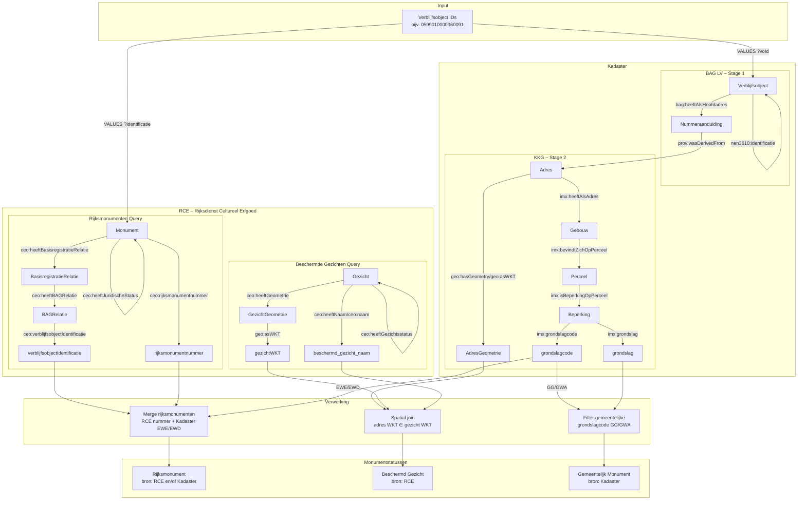

<!-- snippet-start -->

# Monumenten

Een Python package voor het ophalen van monumentgegevens van Nederlandse overheids-API's. Momenteel is het mogelijk om de status van rijksmonumenten, gemeentelijke monumenten en beschermde gezichten op te halen. Eventueel in [VERA-referentiedataformaat](https://www.coraveraonline.nl/index.php/Referentiedata:EENHEIDMONUMENT).

Door middel van de package is het mogelijk om, indienst gewenst, voor tienduizenden verblijfsobjecten per seconde monumentgegevens op te halen. Er zijn geen API-keys nodig.

> [!NOTE]
> In VERA-referentiedataformaat wordt geen onderscheid gemaakt tussen beschermde stads- en dorpsgezichten. Alle beschermde gezichten worden teruggegeven als beschermd stadsgezicht.

> [!WARNING]
> Het is mogelijk dat een verblijfsobject ten onrechte wel of geen monumentstatus heeft. Dit hangt af van hoe het verblijfsobject staat geregistreerd bij het Kadaster en de Rijksdienst voor het Cultureel Erfgoed. Neem contact met hen op als u denkt u een verkeerde monumentale status terugkrijgt.

## Installatie

```bash
pip install monumenten
```

## Voorbeeldoutput

| bag_verblijfsobject_id | is_rijksmonument | rijksmonument_bron | rijksmonument_nummer | rijksmonument_url                                 | is_beschermd_gezicht | beschermd_gezicht_naam   | is_gemeentelijk_monument | grondslag_gemeentelijk_monument                                                        |
| ---------------------- | ---------------- | ------------------ | -------------------- | ------------------------------------------------- | -------------------- | ------------------------ | ------------------------ | -------------------------------------------------------------------------------------- |
| 0599010000360091       | True             | RCE, Kadaster      | 524327               | https://monumentenregister.cultureelerfgoed.nl... | False                | <NA>                     | False                    | <NA>                                                                                   |
| 0599010000486642       | False            | <NA>               | <NA>                 | <NA>                                              | False                | <NA>                     | False                    | <NA>                                                                                   |
| 0599010000281115       | False            | <NA>               | <NA>                 | <NA>                                              | True                 | Kralingen - Midden       | False                    | <NA>                                                                                   |
| 0599010000076715       | False            | <NA>               | <NA>                 | <NA>                                              | False                | <NA>                     | True                     | Gemeentewet: Aanwijzing gemeentelijk monument (voorbescherming, aanwijzing, afschrift) |
| 0599010000146141       | False            | <NA>               | <NA>                 | <NA>                                              | True                 | Rotterdam - Waterproject | True                     | Gemeentewet: Aanwijzing gemeentelijk monument (voorbescherming, aanwijzing, afschrift) |
| 0232010000002251       | False            | <NA>               | <NA>                 | <NA>                                              | False                | <NA>                     | True                     | Gemeentewet: Aanwijzing gemeentelijk monument (voorbescherming, aanwijzing, afschrift) |
| 0599010000341377       | True             | Kadaster           | <NA>                 | <NA>                                              | False                | <NA>                     | False                    | <NA>                                                                                   |

## Architectuur

De package combineert drie databronnen om monumentstatussen te bepalen:



### Bronlogica per Monumenttype

| Monumenttype              | Primaire Bron     | Secundaire Bron    | Logica                                                                        |
| ------------------------- | ----------------- | ------------------ | ----------------------------------------------------------------------------- |
| **Rijksmonument**         | RCE               | Kadaster (EWE/EWD) | `rijksmonument_bron` = "RCE, Kadaster" als beide, "RCE" of "Kadaster" als één |
| **Beschermd Gezicht**     | RCE               | -                  | Spatial join: verblijfsobject geometrie ∈ gezicht geometrie                   |
| **Gemeentelijk Monument** | Kadaster (GG/GWA) | -                  | Direct uit Kadaster beperking met grondslagcode GG of GWA                     |

### Afkortingen

| Afkorting | Betekenis                              |
| --------- | -------------------------------------- |
| **BAG**   | Basisregistratie Adressen en Gebouwen  |
| **KKG**   | Kadaster Knowledge Graph               |
| **RCE**   | Rijksdienst voor het Cultureel Erfgoed |
| **VERA**  | Vastgoed Referentie Architectuur       |
| **WKT**   | Well-Known Text (geometrie formaat)    |

### Grondslagcodes (Kadaster)

| Code    | Wet                                                        | Monumenttype          |
| ------- | ---------------------------------------------------------- | --------------------- |
| **EWE** | Erfgoedwet: Afschrift inschrijving rijksmonumentenregister | Rijksmonument         |
| **EWD** | Erfgoedwet: Ontwerpbesluit aanwijzing (voorbescherming)    | Rijksmonument         |
| **GG**  | Gemeentewet: Besluit monument                              | Gemeentelijk monument |
| **GWA** | Gemeentewet: Aanwijzing gemeentelijk monument              | Gemeentelijk monument |

### SPARQL Endpoints

| Bron             | Endpoint                                                                 |
| ---------------- | ------------------------------------------------------------------------ |
| **BAG LV**       | `https://api.labs.kadaster.nl/datasets/bag/lv/services/baglv/sparql`     |
| **Kadaster KKG** | `https://api.labs.kadaster.nl/datasets/kadaster/kkg/services/kkg/sparql` |
| **RCE**          | `https://api.linkeddata.cultureelerfgoed.nl/datasets/rce/cho/sparql`     |

## Tutorial

<!-- snippet-end -->

Zie [readthedocs](https://monumenten.readthedocs.io/nl/latest/tutorial/).
