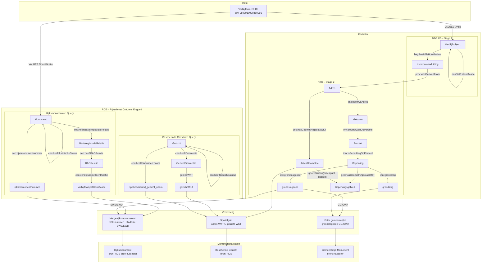

<!-- snippet-start -->

# Monumenten

Een Python package voor het ophalen van monumentgegevens van Nederlandse overheids-API's. Momenteel is het mogelijk om de status van rijksmonumenten, gemeentelijke monumenten en rijksbeschermde gezichten op te halen. Eventueel in [VERA-referentiedataformaat](https://www.coraveraonline.nl/index.php/Referentiedata:EENHEIDMONUMENT).

Door middel van de package is het mogelijk om, indienst gewenst, voor tienduizenden verblijfsobjecten per seconde monumentgegevens op te halen. Er zijn geen API-keys nodig.

> [!NOTE]
> In VERA-referentiedataformaat wordt geen onderscheid gemaakt tussen rijksbeschermde stads- en dorpsgezichten. Alle rijksbeschermde gezichten worden teruggegeven als rijksbeschermd stadsgezicht.

> [!WARNING]
> Het is mogelijk dat een verblijfsobject ten onrechte wel of geen monumentstatus heeft. Dit hangt af van hoe het verblijfsobject staat geregistreerd bij het Kadaster en de Rijksdienst voor het Cultureel Erfgoed. Neem contact met hen op als u denkt u een verkeerde monumentale status terugkrijgt.

> [!TIP]
> Op [deze website](https://huggingface.co/spaces/woonstadrotterdam/monumenten-space) kun je via een gebruikersinterface gebruik maken van de package.

## Installatie

```bash
pip install monumenten
```

## Voorbeeldoutput

| bag_verblijfsobject_id | rijksmonument | rijksmonument_bron | rijksmonument_nummer | rijksmonument_url                                 | rijksbeschermd_gezicht | rijksbeschermd_gezicht_naam | gemeentelijk_monument | grondslag_gemeentelijk_monument                                                        |
| ---------------------- | ------------- | ------------------ | -------------------- | ------------------------------------------------- | ---------------------- | --------------------------- | --------------------- | -------------------------------------------------------------------------------------- |
| 0599010000360091       | True          | RCE, Kadaster      | 524327               | https://monumentenregister.cultureelerfgoed.nl... | False                  | <NA>                        | False                 | <NA>                                                                                   |
| 0599010000486642       | False         | <NA>               | <NA>                 | <NA>                                              | False                  | <NA>                        | False                 | <NA>                                                                                   |
| 0599010000281115       | False         | <NA>               | <NA>                 | <NA>                                              | True                   | Kralingen - Midden          | False                 | <NA>                                                                                   |
| 0599010000076715       | False         | <NA>               | <NA>                 | <NA>                                              | False                  | <NA>                        | True                  | Gemeentewet: Aanwijzing gemeentelijk monument (voorbescherming, aanwijzing, afschrift) |
| 0599010000146141       | False         | <NA>               | <NA>                 | <NA>                                              | True                   | Rotterdam - Waterproject    | True                  | Gemeentewet: Aanwijzing gemeentelijk monument (voorbescherming, aanwijzing, afschrift) |
| 0232010000002251       | False         | <NA>               | <NA>                 | <NA>                                              | False                  | <NA>                        | True                  | Gemeentewet: Aanwijzing gemeentelijk monument (voorbescherming, aanwijzing, afschrift) |
| 0599010000341377       | True          | Kadaster           | <NA>                 | <NA>                                              | False                  | <NA>                        | False                 | <NA>                                                                                   |

## Architectuur

De package combineert drie databronnen om monumentstatussen te bepalen:


```mermaid
flowchart TB

    %% ========================
    %% INPUT
    %% ========================
    subgraph Input["Input"]
        A["Verblijfsobject IDs<br>bijv. 0599010000360091"]
    end

    %% ========================
    %% RCE
    %% ========================
    subgraph RCE["RCE – Rijksdienst Cultureel Erfgoed"]

        subgraph RCE_RM["Rijksmonumenten Query"]
            R1["Monument"]
            R2["BasisregistratieRelatie"]
            R3["BAGRelatie"]
            R4["verblijfsobjectIdentificatie"]
            R5["rijksmonumentnummer"]
        end

        subgraph RCE_BG["Beschermde Gezichten Query"]
            G1["Gezicht"]
            G2["GezichtGeometrie"]
            G3["gezichtWKT"]
            G4["rijksbeschermd_gezicht_naam"]
        end

    end

    %% ========================
    %% KADASTER
    %% ========================
    subgraph Kadaster["Kadaster"]

        subgraph BAG["BAG LV – Stage 1"]
            B1["Verblijfsobject"]
            B2["Nummeraanduiding"]
        end

        subgraph KKG["KKG – Stage 2"]
            K1["Adres"]
            K2["AdresGeometrie"]
            K3["Gebouw"]
            K4["Perceel"]
            K5["Beperking"]
            K6["grondslagcode"]
            K7["grondslag"]
            K8["Beperkingsgebied"]
        end

    end

    %% ========================
    %% PROCESSING
    %% ========================
    subgraph Processing["Verwerking"]
        P1["Merge rijksmonumenten<br>RCE nummer + Kadaster EWE/EWD"]
        P2["Spatial join<br>adres WKT ∈ gezicht WKT"]
        P3["Filter gemeentelijke<br>grondslagcode GG/GWA"]
    end

    %% ========================
    %% OUTPUT
    %% ========================
    subgraph Output["Monumentstatussen"]
        O1["Rijksmonument<br>bron: RCE en/of Kadaster"]
        O2["Beschermd Gezicht<br>bron: RCE"]
        O3["Gemeentelijk Monument<br>bron: Kadaster"]
    end

    %% ========================
    %% FLOWS
    %% ========================

    %% RCE Rijksmonumenten
    A -->|"VALUES ?identificatie"| R1
    R1 -->|"ceo:heeftJuridischeStatus"| R1
    R1 -->|"ceo:rijksmonumentnummer"| R5
    R1 -->|"ceo:heeftBasisregistratieRelatie"| R2
    R2 -->|"ceo:heeftBAGRelatie"| R3
    R3 -->|"ceo:verblijfsobjectIdentificatie"| R4

    %% RCE Beschermde Gezichten
    G1 -->|"ceo:heeftGeometrie"| G2
    G1 -->|"ceo:heeftGezichtsstatus"| G1
    G1 -->|"ceo:heeftNaam/ceo:naam"| G4
    G2 -->|"geo:asWKT"| G3

    %% Kadaster BAG
    A -->|"VALUES ?voId"| B1
    B1 -->|"nen3610:identificatie"| B1
    B1 -->|"bag:heeftAlsHoofdadres"| B2

    %% Kadaster KKG
    B2 -->|"prov:wasDerivedFrom"| K1
    K1 -->|"geo:hasGeometry/geo:asWKT"| K2
    K1 -->|"imx:heeftAlsAdres"| K3
    K3 -->|"imx:bevindtZichOpPerceel"| K4
    K4 -->|"imx:isBeperkingOpPerceel"| K5
    K5 -->|"imx:grondslagcode"| K6
    K5 -->|"imx:grondslag"| K7
    K5 -->|"geo:hasGeometry/geo:asWKT"| K8
    K2 -->|"geof:sfWithin(adrespunt, gebied)"| K8

    %% Processing
    R4 --> P1
    R5 --> P1
    K6 -->|"EWE/EWD"| P1
    K2 --> P2
    G3 --> P2
    G4 --> P2
    K6 -->|"GG/GWA"| P3
    K7 --> P3

    %% Output
    P1 --> O1
    P2 --> O2
    P3 --> O3
```

### Bronlogica per Monumenttype

| Monumenttype               | Primaire Bron     | Secundaire Bron    | Logica                                                                                                                                                                                             |
| -------------------------- | ----------------- | ------------------ | -------------------------------------------------------------------------------------------------------------------------------------------------------------------------------------------------- |
| **Rijksmonument**          | RCE               | Kadaster (EWE/EWD) | `rijksmonument_bron` = "RCE, Kadaster" als beide, "RCE" of "Kadaster" als één. Kadaster telt alleen als het adrespunt binnen het beperkingsgebied ligt (zie [Beperkingsgebied](#beperkingsgebied)) |
| **Rijksbeschermd Gezicht** | RCE               | -                  | Spatial join: verblijfsobject geometrie ∈ gezicht geometrie                                                                                                                                        |
| **Gemeentelijk Monument**  | Kadaster (GG/GWA) | -                  | Kadaster beperking met grondslagcode GG of GWA, alleen als het adrespunt binnen het beperkingsgebied ligt (zie [Beperkingsgebied](#beperkingsgebied))                                              |

### Afkortingen

| Afkorting | Betekenis                                                                                                                             |
| --------- | ------------------------------------------------------------------------------------------------------------------------------------- |
| **BAG**   | Basisregistratie Adressen en Gebouwen: alle adressen, verblijfsobjecten en panden in Nederland                                        |
| **BGT**   | Basisregistratie Grootschalige Topografie: gedetailleerde kaart van Nederland met onder meer gebouwen, wegen, water, muren en bruggen |
| **BRK**   | Basisregistratie Kadaster: kadastrale percelen, met hun eigenaren, rechten en beperkingen                                             |
| **KKG**   | Kadaster Knowledge Graph                                                                                                              |
| **RCE**   | Rijksdienst voor het Cultureel Erfgoed                                                                                                |
| **VERA**  | Vastgoed Referentie Architectuur                                                                                                      |
| **WKT**   | Well-Known Text (geometrie formaat)                                                                                                   |

### Grondslagcodes (Kadaster)

| Code    | Wet                                                        | Monumenttype          |
| ------- | ---------------------------------------------------------- | --------------------- |
| **EWE** | Erfgoedwet: Afschrift inschrijving rijksmonumentenregister | Rijksmonument         |
| **EWD** | Erfgoedwet: Ontwerpbesluit aanwijzing (voorbescherming)    | Rijksmonument         |
| **GG**  | Gemeentewet: Besluit monument                              | Gemeentelijk monument |
| **GWA** | Gemeentewet: Aanwijzing gemeentelijk monument              | Gemeentelijk monument |

### Beperkingsgebied

Monumentstatus staat in het Kadaster geregistreerd als een _publiekrechtelijke beperking_: een aantekening dat de overheid regels stelt aan wat je met een stuk grond of gebouw mag doen. Zo'n beperking is gekoppeld aan een _perceel_, een stuk grond met een eigen kadastraal nummer. Op één perceel kunnen meerdere gebouwen staan, en een gebouw kan op meerdere percelen staan.

Daarnaast legt de overheid die de beperking registreert (bijvoorbeeld de gemeente of de RCE) vast voor welk gebied de beperking precies geldt: het _beperkingsgebied_. Zonder extra controle zou elk adres in een gebouw dat het perceel raakt de status krijgen, ook als het monument een ander gebouw op dat perceel is, of als het gebouw maar met een strookje op het perceel staat. Daarom telt een beperking alleen als het _adrespunt_ van het verblijfsobject (de locatie van het adres in de BAG, een punt binnen het pand) binnen het beperkingsgebied ligt. Die controle (`geof:sfWithin`) wordt door het Kadaster zelf uitgevoerd als onderdeel van de KKG-query.

Hoe nauwkeurig dat werkt, hangt af van hoe het beperkingsgebied is vastgelegd. Het Kadaster kent vier manieren (in de data het veld `typeBeperkingsgebied`):

| Type in de data                   | Het beperkingsgebied is…                                                            | Welke adressen krijgen de status                                                                                  |
| --------------------------------- | ----------------------------------------------------------------------------------- | ----------------------------------------------------------------------------------------------------------------- |
| `BAG`                             | de omtrek van één pand, overgenomen uit de BAG                                      | alleen adressen in dat pand                                                                                       |
| `Handmatig ingetekende geometrie` | een vlak dat de overheid zelf op de kaart heeft getekend                            | alleen adressen in dat vlak                                                                                       |
| `BGT`                             | één object van de BGT-kaart, bijvoorbeeld een gebouw, muur of brug                  | alleen adressen in dat object                                                                                     |
| `BRK`                             | het hele perceel (of meerdere percelen), zonder aan te geven welk gebouw bedoeld is | alle adressen waarvan het adrespunt op het perceel ligt; gebouwen op hetzelfde perceel zijn niet te onderscheiden |

Alle rijksmonumenten (grondslagcodes EWE/EWD) zijn door de RCE met type `BRK` vastgelegd. Bij een rijksmonument met bron "Kadaster" kan het daarom zo zijn dat niet dit gebouw, maar een ander gebouw op hetzelfde perceel het eigenlijke monument is.

### SPARQL Endpoints

| Bron             | Endpoint                                                             |
| ---------------- | -------------------------------------------------------------------- |
| **BAG LV**       | `https://api.labs.kadaster.nl/datasets/bag/lv/services/baglv/sparql` |
| **Kadaster KKG** | `https://data.kkg.kadaster.nl/service/sparql`                        |
| **RCE**          | `https://api.linkeddata.cultureelerfgoed.nl/datasets/rce/cho/sparql` |

### Retry-gedrag

Aanroepen naar Kadaster (BAG LV, KKG) en RCE gebruiken een gedeelde retry-logica: maximaal 2 pogingen per request, bij mislukking 3 seconden wachten. Alleen tijdelijke fouten worden herhaald (HTTP 429, 500, 502, 503, 504 en netwerk-/verbindingsfouten); permanente 4xx worden direct doorgegeven. Faalt een aanroep na retries, dan wordt de set IDs/URIs in tweeën gedeeld en elk deel opnieuw geprobeerd (recursief, per API, tot min. 1 ID of max. splitdiepte 10); definitief falende aanroepen worden overgeslagen met een waarschuwing.

## Tutorial

<!-- snippet-end -->

Zie [readthedocs](https://monumenten.readthedocs.io/nl/latest/tutorial/).
