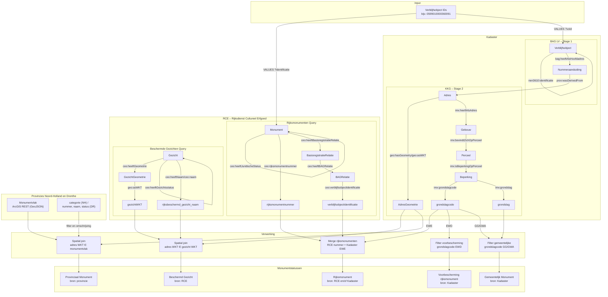

<!-- snippet-start -->

# Monumenten

Een Python package voor het ophalen van monumentgegevens van Nederlandse overheids-API's. Momenteel is het mogelijk om de status van rijksmonumenten, gemeentelijke monumenten, provinciale monumenten en rijksbeschermde gezichten op te halen. Eventueel in [VERA-referentiedataformaat](https://www.coraveraonline.nl/index.php/Referentiedata:EENHEIDMONUMENT).

Door middel van de package is het mogelijk om, indienst gewenst, voor tienduizenden verblijfsobjecten per seconde monumentgegevens op te halen. Er zijn geen API-keys nodig.

> [!NOTE]
> In VERA-referentiedataformaat wordt geen onderscheid gemaakt tussen rijksbeschermde stads- en dorpsgezichten. Alle rijksbeschermde gezichten worden teruggegeven als rijksbeschermd stadsgezicht.

> [!WARNING]
> Het is mogelijk dat een verblijfsobject ten onrechte wel of geen monumentstatus heeft. Dit hangt af van hoe het verblijfsobject staat geregistreerd bij het Kadaster en de Rijksdienst voor het Cultureel Erfgoed. Neem contact met hen op als u denkt u een verkeerde monumentale status terugkrijgt.

> [!NOTE]
> Een **voorbescherming** van een rijksmonument (Kadaster grondslagcode `EWD`: het ontwerpbesluit tot aanwijzing is toegezonden, maar het monument is nog niet ingeschreven in het rijksmonumentenregister) telt **niet** als rijksmonument. Artikel 8a van het Besluit huurprijzen woonruimte kent de opslag toe aan "een rijksmonument als bedoeld in artikel 1.1 van de Erfgoedwet", en dat is uitsluitend een monument dat in het rijksmonumentenregister is ingeschreven. Voorbescherming wordt daarom apart teruggegeven in de kolom `rijksmonument_voorbescherming` en heeft geen VERA-code. Voor gemeentelijke monumenten is dit onderscheid niet te maken: het Kadaster bundelt voorbescherming, aanwijzing en afschrift in één grondslagcode (`GWA`), waardoor `gemeentelijk_monument` ook voorbeschermde gemeentelijke monumenten omvat.

> [!TIP]
> Op [deze website](https://huggingface.co/spaces/woonstadrotterdam/monumenten-space) kun je via een gebruikersinterface gebruik maken van de package.

## Installatie

```bash
pip install monumenten
```

## Voorbeeldoutput

| bag_verblijfsobject_id | rijksmonument | rijksmonument_bron | rijksmonument_nummer | rijksmonument_url                                 | rijksmonument_voorbescherming | rijksbeschermd_gezicht | rijksbeschermd_gezicht_naam | gemeentelijk_monument | grondslag_gemeentelijk_monument                                                        | provinciaal_monument | provinciaal_monument_omschrijving |
| ---------------------- | ------------- | ------------------ | -------------------- | ------------------------------------------------- | ----------------------------- | ---------------------- | --------------------------- | --------------------- | -------------------------------------------------------------------------------------- | -------------------- | --------------------------------- |
| 0599010000360091       | True          | RCE, Kadaster      | 524327               | https://monumentenregister.cultureelerfgoed.nl... | False                         | False                  | <NA>                        | False                 | <NA>                                                                                   | False                | <NA>                              |
| 0599010000486642       | False         | <NA>               | <NA>                 | <NA>                                              | False                         | False                  | <NA>                        | False                 | <NA>                                                                                   | False                | <NA>                              |
| 0599010000281115       | False         | <NA>               | <NA>                 | <NA>                                              | False                         | True                   | Kralingen - Midden          | False                 | <NA>                                                                                   | False                | <NA>                              |
| 0599010000076715       | False         | <NA>               | <NA>                 | <NA>                                              | False                         | False                  | <NA>                        | True                  | Gemeentewet: Aanwijzing gemeentelijk monument (voorbescherming, aanwijzing, afschrift) | False                | <NA>                              |
| 0599010000146141       | False         | <NA>               | <NA>                 | <NA>                                              | False                         | True                   | Rotterdam - Waterproject    | True                  | Gemeentewet: Aanwijzing gemeentelijk monument (voorbescherming, aanwijzing, afschrift) | False                | <NA>                              |
| 0232010000002251       | False         | <NA>               | <NA>                 | <NA>                                              | False                         | False                  | <NA>                        | True                  | Gemeentewet: Aanwijzing gemeentelijk monument (voorbescherming, aanwijzing, afschrift) | False                | <NA>                              |
| 0599010000341377       | True          | Kadaster           | <NA>                 | <NA>                                              | False                         | False                  | <NA>                        | False                 | <NA>                                                                                   | False                | <NA>                              |
| 1680010000004810       | False         | <NA>               | <NA>                 | <NA>                                              | False                         | False                  | <NA>                        | False                 | <NA>                                                                                   | True                 | PM1-0001 Dwarshuisboerderij Rolde |

## Architectuur

De package combineert vier databronnen om monumentstatussen te bepalen:


```mermaid
flowchart TB

    %% ========================
    %% INPUT
    %% ========================
    subgraph Input["Input"]
        A["Verblijfsobject IDs<br>bijv. 0599010000360091"]
    end

    %% ========================
    %% RCE
    %% ========================
    subgraph RCE["RCE – Rijksdienst Cultureel Erfgoed"]

        subgraph RCE_RM["Rijksmonumenten Query"]
            R1["Monument"]
            R2["BasisregistratieRelatie"]
            R3["BAGRelatie"]
            R4["verblijfsobjectIdentificatie"]
            R5["rijksmonumentnummer"]
        end

        subgraph RCE_BG["Beschermde Gezichten Query"]
            G1["Gezicht"]
            G2["GezichtGeometrie"]
            G3["gezichtWKT"]
            G4["rijksbeschermd_gezicht_naam"]
        end

    end

    %% ========================
    %% KADASTER
    %% ========================
    subgraph Kadaster["Kadaster"]

        subgraph BAG["BAG LV – Stage 1"]
            B1["Verblijfsobject"]
            B2["Nummeraanduiding"]
        end

        subgraph KKG["KKG – Stage 2"]
            K1["Adres"]
            K2["AdresGeometrie"]
            K3["Gebouw"]
            K4["Perceel"]
            K5["Beperking"]
            K6["grondslagcode"]
            K7["grondslag"]
        end

    end

    %% ========================
    %% PROVINCIES
    %% ========================
    subgraph Provincies["Provincies Noord-Holland en Drenthe"]
        V1["Monumentvlak<br>ArcGIS REST (GeoJSON)"]
        V2["categorie (NH) /<br>nummer, naam, status (DR)"]
    end

    %% ========================
    %% PROCESSING
    %% ========================
    subgraph Processing["Verwerking"]
        P1["Merge rijksmonumenten<br>RCE nummer + Kadaster EWE"]
        P2["Spatial join<br>adres WKT ∈ gezicht WKT"]
        P3["Filter gemeentelijke<br>grondslagcode GG/GWA"]
        P4["Spatial join<br>adres WKT ∈ monumentvlak"]
        P5["Filter voorbescherming<br>grondslagcode EWD"]
    end

    %% ========================
    %% OUTPUT
    %% ========================
    subgraph Output["Monumentstatussen"]
        O1["Rijksmonument<br>bron: RCE en/of Kadaster"]
        O2["Beschermd Gezicht<br>bron: RCE"]
        O3["Gemeentelijk Monument<br>bron: Kadaster"]
        O4["Provinciaal Monument<br>bron: provincie"]
        O5["Voorbescherming rijksmonument<br>bron: Kadaster"]
    end

    %% ========================
    %% FLOWS
    %% ========================

    %% RCE Rijksmonumenten
    A -->|"VALUES ?identificatie"| R1
    R1 -->|"ceo:heeftJuridischeStatus"| R1
    R1 -->|"ceo:rijksmonumentnummer"| R5
    R1 -->|"ceo:heeftBasisregistratieRelatie"| R2
    R2 -->|"ceo:heeftBAGRelatie"| R3
    R3 -->|"ceo:verblijfsobjectIdentificatie"| R4

    %% RCE Beschermde Gezichten
    G1 -->|"ceo:heeftGeometrie"| G2
    G1 -->|"ceo:heeftGezichtsstatus"| G1
    G1 -->|"ceo:heeftNaam/ceo:naam"| G4
    G2 -->|"geo:asWKT"| G3

    %% Kadaster BAG
    A -->|"VALUES ?voId"| B1
    B1 -->|"nen3610:identificatie"| B1
    B1 -->|"bag:heeftAlsHoofdadres"| B2

    %% Kadaster KKG
    B2 -->|"prov:wasDerivedFrom"| K1
    K1 -->|"geo:hasGeometry/geo:asWKT"| K2
    K1 -->|"imx:heeftAlsAdres"| K3
    K3 -->|"imx:bevindtZichOpPerceel"| K4
    K4 -->|"imx:isBeperkingOpPerceel"| K5
    K5 -->|"imx:grondslagcode"| K6
    K5 -->|"imx:grondslag"| K7

    %% Processing
    R4 --> P1
    R5 --> P1
    K6 -->|"EWE"| P1
    K6 -->|"EWD"| P5
    K2 --> P2
    G3 --> P2
    G4 --> P2
    K6 -->|"GG/GWA"| P3
    K7 --> P3

    %% Provincies (alleen bevraagd als een adrespunt in NH of DR ligt)
    K2 --> P4
    V1 --> P4
    V2 -->|"filter en omschrijving"| P4

    %% Output
    P1 --> O1
    P2 --> O2
    P3 --> O3
    P4 --> O4
    P5 --> O5
```

### Bronlogica per Monumenttype

| Monumenttype                      | Primaire Bron     | Secundaire Bron | Logica                                                                                           |
| --------------------------------- | ----------------- | --------------- | ------------------------------------------------------------------------------------------------ |
| **Rijksmonument**                 | RCE               | Kadaster (EWE)  | `rijksmonument_bron` = "RCE, Kadaster" als beide, "RCE" of "Kadaster" als één                    |
| **Rijksbeschermd Gezicht**        | RCE               | -               | Spatial join: verblijfsobject geometrie ∈ gezicht geometrie                                      |
| **Gemeentelijk Monument**         | Kadaster (GG/GWA) | -               | Direct uit Kadaster beperking met grondslagcode GG of GWA                                        |
| **Voorbescherming rijksmonument** | Kadaster (EWD)    | -               | `rijksmonument_voorbescherming` = True; telt niet mee voor `rijksmonument` (art. 1.1 Erfgoedwet) |

### Afkortingen

| Afkorting | Betekenis                              |
| --------- | -------------------------------------- |
| **BAG**   | Basisregistratie Adressen en Gebouwen  |
| **KKG**   | Kadaster Knowledge Graph               |
| **RCE**   | Rijksdienst voor het Cultureel Erfgoed |
| **VERA**  | Vastgoed Referentie Architectuur       |
| **WKT**   | Well-Known Text (geometrie formaat)    |

### Grondslagcodes (Kadaster)

| Code    | Wet                                                                                                  | Monumenttype                                       |
| ------- | ---------------------------------------------------------------------------------------------------- | -------------------------------------------------- |
| **EWE** | Erfgoedwet: Afschrift inschrijving rijksmonumentenregister                                           | Rijksmonument                                      |
| **EWD** | Erfgoedwet: Ontwerpbesluit aanwijzing (voorbescherming)                                              | Voorbescherming rijksmonument (geen rijksmonument) |
| **GG**  | Gemeentewet: Besluit monument                                                                        | Gemeentelijk monument                              |
| **GWA** | Gemeentewet: Aanwijzing gemeentelijk monument (voorbescherming, aanwijzing en afschrift in één code) | Gemeentelijk monument                              |

### SPARQL Endpoints

| Bron             | Endpoint                                                             |
| ---------------- | -------------------------------------------------------------------- |
| **BAG LV**       | `https://api.labs.kadaster.nl/datasets/bag/lv/services/baglv/sparql` |
| **Kadaster KKG** | `https://data.kkg.kadaster.nl/service/sparql`                        |
| **RCE**          | `https://api.linkeddata.cultureelerfgoed.nl/datasets/rce/cho/sparql` |

### Retry-gedrag

Aanroepen naar Kadaster (BAG LV, KKG) en RCE gebruiken een gedeelde retry-logica: maximaal 2 pogingen per request, bij mislukking 3 seconden wachten. Alleen tijdelijke fouten worden herhaald (HTTP 429, 500, 502, 503, 504 en netwerk-/verbindingsfouten); permanente 4xx worden direct doorgegeven. Faalt een aanroep na retries, dan wordt de set IDs/URIs in tweeën gedeeld en elk deel opnieuw geprobeerd (recursief, per API, tot min. 1 ID of max. splitdiepte 10); definitief falende aanroepen worden overgeslagen met een waarschuwing.

### Provinciale monumenten

Naast de drie monumenttypes hierboven bepaalt de package ook de status **Provinciaal Monument** (bron: de provincie). Alleen Noord-Holland en Drenthe wijzen provinciale monumenten aan. Het Kadaster registreert ze niet (de Wkpb-grondslagcodes `MP` en `PVA` bevatten geen registraties) en de RCE evenmin. Daarom bevraagt de package de kaartservices van de provincies zelf:

| Provincie         | Service                                                                                                    | Filter                                                                                                         |
| ----------------- | ---------------------------------------------------------------------------------------------------------- | -------------------------------------------------------------------------------------------------------------- |
| **Noord-Holland** | `https://geoservices.noord-holland.nl/ags/rest/services/oi_dataservice_protected_sites/MapServer/2/query`  | Categorieën _Kleine objecten_, _Stelling van Amsterdam_, _Stelling van Den Helder_, _Waterstaatkundige werken_ |
| **Drenthe**       | `https://kaartportaal.drenthe.nl/server/rest/services/37/Provinciale_monumenten_Drenthe/MapServer/3/query` | Status `beschermd`                                                                                             |

Een verblijfsobject is een provinciaal monument als zijn adrespunt (uit het Kadaster) binnen een monumentvlak ligt, net als bij rijksbeschermde gezichten. `provinciaal_monument_omschrijving` bevat in Drenthe het nummer en de naam van het monument (bijvoorbeeld `PM1-0001 Dwarshuisboerderij Rolde`); in Noord-Holland alleen de categorie, omdat de provincie geen naam of nummer per vlak publiceert. Bij meerdere vlakken worden de omschrijvingen gescheiden door `, `. In VERA-referentiedataformaat is de code `PRO`.

Keuzes en beperkingen:

- **Dijken tellen niet mee.** Bij de Noord-Hollandse categorie _Keringselementen_ is de dijk zelf het monument, niet de bebouwing erop. Zonder dit filter kregen bijvoorbeeld 173 vakantiehuisjes op de Zeedijk bij Uitdam onterecht de status. Ook archeologische terreinen en het provinciaal beschermd dorpsgezicht Barsingerhorn tellen niet mee: een pand wordt geen monument doordat het in een beschermd gebied ligt. Een onbekende categorie of status wordt genegeerd met een waarschuwing in de log.
- **Alleen aangewezen monumenten.** Een voorbeschermd object (voornemen tot aanwijzing) telt niet mee, in lijn met het Besluit huurprijzen woonruimte, dat spreekt van een "door gedeputeerde staten aangewezen provinciaal monument".
- **Nauwkeurigheid.** Van de gebouwde monumenten in het Noord-Hollandse erfgoedregister (juli 2025) wordt ongeveer 91% gevonden. Gemist worden vooral objecten _bij_ een adres (een grenspaal, seinmast of hek) en een monumentaal bijgebouw op hetzelfde erf als het adres: die krijgen `False`. Andersom kan een nieuw gebouw op een monumentaal terrein (bijvoorbeeld een fort van de Stelling van Amsterdam) onterecht `True` krijgen; controleer twijfelgevallen aan de hand van de omschrijving. Een marge rond de vlakken is bewust niet toegepast: die leverde vrijwel alleen buurpanden op.
- **Geen download buiten Noord-Holland en Drenthe.** De service van een provincie wordt alleen opgehaald (en 7 dagen gecachet) als een adrespunt binnen een ruime rechthoek om die provincie ligt. Mislukt het ophalen na retries, dan stopt de hele aanroep met een `ProvincialeMonumentenError`; de status wordt dus nooit stilzwijgend `False` voor een hele provincie.
- **Combinaties.** Volgens de provinciale verordeningen kan een object niet tegelijk rijks- of gemeentelijk én provinciaal monument zijn. De package dwingt dat niet af, omdat de Kadaster-statussen per perceel gelden en dus ook buurgebouwen kunnen raken.

## Tutorial

<!-- snippet-end -->

Zie [readthedocs](https://monumenten.readthedocs.io/nl/latest/tutorial/).
